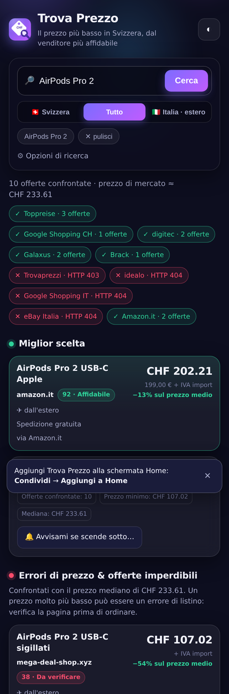

# 🏷️ Trova Prezzo

Web app (PWA) per chi compra **in Svizzera**: cerca un prodotto sui negozi online, **confronta i prezzi
in franchi**, valuta **quanto è affidabile chi vende** e mette in evidenza **possibili errori di prezzo e
offerte imperdibili**. Le offerte italiane ed estere vengono convertite al cambio del giorno e, a scelta,
maggiorate della **stima dell'IVA all'importazione (8.1%)**, così il confronto con i negozi svizzeri è onesto.

Funziona interamente nel browser: nessun server, nessuna API key, nessun dato che esce dal telefono.
Pensata per essere installata sulla schermata Home dell'iPhone.

<p align="center"></p>

---

## Cosa fa

| | |
|---|---|
| 🇨🇭 **Negozi svizzeri** | Toppreise, Google Shopping CH, digitec, Galaxus, Brack e — opzionali — microspot, Interdiscount, Ricardo |
| 🇮🇹 **Italia ed estero** | Trovaprezzi, idealo, Google Shopping IT, eBay Italia, Amazon.it e Amazon.de: si attivano con il selettore *Tutto* o *Italia · estero* |
| 💱 **Confronto in franchi** | Cambio EUR/CHF dalla BCE (via `frankfurter.app`), tenuto in cache 24 ore, con valore di riserva se la rete non risponde |
| 🛃 **Costi di import** | Stima dell'IVA svizzera dell'8.1% sugli acquisti esteri, con la franchigia sotto i ~5 CHF di imposta; disattivabile |
| 🛡️ **Punteggio di affidabilità** | 0-100 per venditore: catalogo di negozi svizzeri e italiani più euristiche su dominio e TLD (un `.ch` sconosciuto parte più in alto di un `.xyz`) |
| 🏆 **Miglior scelta** | Non il prezzo più basso e basta: il miglior compromesso tra prezzo (55%) e affidabilità (45%), calcolato sui prezzi già convertiti |
| 🎯 **Errori di prezzo** | Prezzo ≤ 40% della mediana di mercato **da un venditore affidabile** → probabile errore di listino |
| 🔥 **Offerte imperdibili** | Prezzo tra il 40% e il 65% della mediana, da venditore con reputazione sufficiente |
| ⚠️ **Anti-abbaglio** | Sconto forte da negozio poco noto → segnalato come *da verificare*, mai come affare |
| 🧹 **Filtro rumore** | Accessori e ricambi (prezzo < 12% della mediana o titolo poco pertinente) finiscono tra gli esclusi |
| 🔔 **Avvisi prezzo** | Ricerca salvata con un prezzo obiettivo: quando la ripeti ti avvisa se qualcuno è sceso sotto |
| 📱 **PWA offline** | Il guscio dell'app resta in cache: si apre anche senza rete (i prezzi ovviamente no) |

## Come funziona

1. **Recupero pagine** — il browser non può leggere direttamente i siti dei negozi (CORS), quindi le
   pagine passano da proxy pubblici (`allorigins`, `codetabs`, `corsproxy`, `r.jina.ai`) provati in
   sequenza finché uno risponde; il proxy che ha funzionato viene ricordato e riprovato per primo.
2. **Estrazione** — invece di dipendere dalle classi CSS di ogni sito (che cambiano di continuo), il
   parser parte dai **testi che contengono un prezzo** e risale nel DOM fino al contenitore che ha un
   link e un titolo. Riconosce sia la notazione svizzera (`1'299.90`, `CHF 249.-`, `Fr. 89.–`) sia quella
   italiana (`1.299,90 €`); quando il negozio scrive solo `219.90` e mette `CHF` in un altro elemento, il
   numero nudo viene accettato solo se il contesto conferma che è un prezzo. Sugli aggregatori cerca in
   più il nome del negozio. Se il proxy restituisce testo/markdown invece di HTML, usa un parser a righe.
3. **Pulizia** — pertinenza rispetto alla query (almeno il 55% delle parole nel titolo), deduplica
   per negozio+prezzo, rimozione degli outlier.
4. **Normalizzazione** — ogni prezzo viene portato nella valuta di confronto e, se l'offerta è estera,
   maggiorato della stima dell'IVA import: solo a quel punto i prezzi sono paragonabili.
5. **Analisi** — mediana calcolata sui venditori credibili (affidabilità ≥ 60) e ricalcolata dopo aver
   tolto gli outlier; da lì derivano risparmio percentuale, classificazione dell'affare e punteggio finale.

Lo stato di ogni fonte è mostrato in tempo reale: se un sito blocca il proxy lo vedi scritto, e l'app
propone comunque i link per aprire la ricerca a mano.

## Pubblicazione su GitHub Pages

1. **Settings → Pages → Build and deployment → Source: `Deploy from a branch`**
2. Branch: `main` (o il branch di questo lavoro), cartella `/ (root)` → **Save**
3. Dopo un minuto l'app è su `https://<utente>.github.io/Trova-Prezzo/`

### Aggiungere l'icona alla schermata Home (iPhone/iPad)

1. Apri il link **con Safari** (non Chrome: solo Safari installa le web app su iOS)
2. Tocca **Condividi** (il quadrato con la freccia) → **Aggiungi a Home**
3. Confermi il nome *Trova Prezzo* → l'icona 🏷️ compare tra le app e si apre a schermo intero

## Struttura

```
index.html                 interfaccia
assets/styles.css          tema scuro/chiaro, layout mobile-first
assets/app.js              proxy, parser, analisi prezzi, UI
sw.js                      service worker (guscio offline)
manifest.webmanifest       installazione PWA
icons/                     icona cartellino + lente (SVG e PNG)
```

## Limiti da conoscere

- I proxy CORS pubblici sono gratuiti e **non garantiti**: possono essere lenti, avere rate limit o
  essere bloccati dal negozio. L'app prova più proxy e degrada mostrando i link diretti.
- Alcuni siti (Amazon in particolare) rispondono spesso con una pagina anti-bot: in quel caso la fonte
  risulta "bloccata" ed è normale.
- I prezzi sono letti dalle pagine pubbliche al momento della ricerca, **possono non includere le
  spese di spedizione** e cambiano in continuazione.
- La maggiorazione dell'8.1% è **solo l'IVA all'importazione**: non comprende le spese di sdoganamento
  del corriere (spesso 10-20 CHF), eventuali dazi, né il fastidio di gestire una garanzia all'estero.
- Gli indirizzi di ricerca dei negozi svizzeri non hanno potuto essere verificati dall'ambiente di
  sviluppo, che ha la rete limitata: se una fonte risponde sempre "nessun prezzo leggibile", basta
  correggere il suo URL in `SOURCES` (`assets/app.js`) — è una riga sola.
- Un prezzo molto più basso della media può essere un vero errore di listino, ma anche un prodotto
  diverso, ricondizionato o un venditore poco serio. **Controlla sempre la pagina del negozio prima di comprare.**
